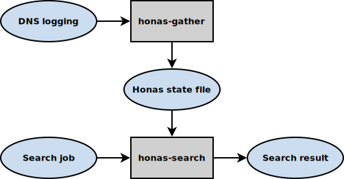

[TOC]

Honas - Host name searching                      {#mainpage}
===========================

Honas is a system for collecting large quantities of hostname lookup requests
in order to check afterwards if certain hostnames have been requested by some
or many clients.

It tries to prevent disclosing privacy sensitive details about individual
clients by making use of coarse grained cardinality estimation using multiple
probabilistic data structures in the form of [bloom
filters](https://en.wikipedia.org/wiki/Bloom_filter).

Build instructions                               {#build_instructions}
------------------

Honas is build using the Meson build system, for installation instructions and
more information, see the [Meson website](http://mesonbuild.com/).

### Building the programs:

Create the meson build directory:

```
meson build/
```

Enter the meson build directory and build all targets:

```
cd build/
ninja
```

### Project build-time configuration options

Run from inside the meson build directory.

- Change the default `honas-gather.conf` path (default: `/etc/honas/gather.conf`):
	`meson configure -Ddefault_honas_gather_config_path=/path/to/honas-gather.conf`
- Disable the use some hand-coded assembler optimizations:
	`meson configure -Duse_asm=false`

### Additional build options

Run from inside the meson build directory.

- Release mode:
	`meson configure -Dbuildtype=release`
- Strip executables:
	`meson configure -Dstrip=true`
- More warnings:
	`meson configure -Dwarning_level=3`
- Fatal warnings:
	`meson configure -Dwerror=true`
- Address sanitzation:
	`meson configure -Db_sanitize=address`
- For more options see:
	`meson configure`

### Suggested build instructions for release builds

```
meson build/
cd build/
meson configure -Dbuildtype=release -Dwarning_level=1 -Dwerror=false -Dunity=on -Db_lto=true -Db_coverage=false -Db_sanitize=none
ninja
```

Documentation                                    {#documentation}
-------------

The interfaces are documented using [Doxygen](http://www.doxygen.org/). The
main page of the generated documentation will also include this text in a HTML
rendered form.

 To generate the documentation install doxygen and run (from the meson build
directory):

```
ninja doc
```

### Overview                                     {#overview}

The main Honas programming interface is the [honas state](@ref honas_state).
But Honas is mainly designed to be run in the form of a set of programs that
generate and search through the honas state files that are managed through the
said interface.

Below is a diagram that shows the different parts of Honas and how they fit together:



Each of these parts is discussed in more detail below.

### DNS logging                                  {#dns_logging}

Honas is designed to be run as a separate process that processes DNS server
logging. Multiple logging formats can be supported through a modular input
system.

Depending on the capabilities of the DNS server Honas log processing can be
started directly as a log processing command, as a log processer configured
through a syslog service or as a batch processor by calling it on archived
logfiles.

#### The `dns-relayd` input format

Currently Honas only features a parser for the dns-relayd "analyze_dns_handler"
format read from stdin. This is a very basic DNS request logging format that
can be easily generated.

##### Format

```
<integer> <ip> <string>/<number>/<number>
```

Explanation:

- The first integer is the timestamp as the number of seconds since unix epoch
- Followed by a single space character
- Followed by the client's IP address (for IPv4 in the dotted decimal notation or for IPv6 in its canonical representation)
- Followed by a single space character
- Followed by the host name being looked up (with or without trailing dot)
- Followed by a forward slash character
- Followed by the [DNS CLASS](https://www.iana.org/assignments/dns-parameters/dns-parameters.xhtml#dns-parameters-2) as a number
- Followed by a forward slash character
- Followed by the [DNS Resourc Record (RR) TYPE](https://www.iana.org/assignments/dns-parameters/dns-parameters.xhtml#dns-parameters-4) as a number
- Followed by a new line character

##### Notes

- The timestamp value is ignored and "now" is used when processing the entries in the state file
- Only fully qualified domain names are handled properly
- All host names are expected to be in ASCII, other Unicode host names should be [punycode](https://en.wikipedia.org/wiki/Punycode) encoded
- A trailing dot after the host name is stripped before being hashed
- Only DNS CLASS 1 (`Internet (IN)`) gets processed
- Only DNS Resource Records of type 1 (`A`), 2 (`NS`), 15 (`MX`) and 28 (`AAAA`) are processed

##### Example logging

```
1509929280 192.168.0.101 e13074.d.akamaiedge.net/1/1
1509929280 192.168.0.98 pop-eur-benelux-courier.push-apple.com.akadns.net/1/1
1509929280 192.168.0.92 e1863.dspb.akamaiedge.net/1/1
1509929281 192.168.0.94 sirius.mwbsys.com/1/1
1509929281 192.168.0.89 auth.ns1.ff.avast.com/1/1
1509929281 192.168.0.90 olympia.prod.mozaws.net/1/1
1509929281 192.168.0.99 e4578.g.akamaiedge.net/1/1
```

### The Honas state file                         {#honas_state_file}

The parsed host name lookups are saved to Honas state files. There are multiple
state files, one for each period of time.

The finished state files are named after their period begin timestamp (the time
they get created) in UTC, like `2017-12-06T11:50:21.hs`. This ensures that
simply sorting the state files alphabetically will order them correctly in
time.

The period ends on an exact multiple of the period duration since the unix
epoch time. This ensures that results of multiple servers with the same period
duration can be grouped together based on their period end time.

#### State file header

Each honas state file contains all the relevant meta data in the state file
header and no separate configuration of other knowledge is necessary to
interpret results contained within that file.

This includes:
- Period begin and end timestamps
- The configuration about the bloom filters:
  + Number of bloom filters
  + Number of bits per bloom filter
  + Number of hashes per bloom filter
  + Number of bloom filters per client
- Statistical information:
  + First request
  + Last request
  + Number of requests
  + Estimated number of distinct clients
  + Estimated number of distinct host names

All state files have a version number that should follow [Semantic
Versioning](https://semver.org/) rules.

#### Bloom filters

Each state file contains a number of [bloom
filters](https://en.wikipedia.org/wiki/Bloom_filter). Host name lookups are
registered based on a SHA-256 hash of that host name and for all parent
domains, except for the TLD itself.  For checking if a host name might have
been looked up only the SHA-256 hash of the host name to be checked has to be
provided.

Different clients will update a different subset of the bloom filters in the
state file. The number of bloom filters a host name hash is found in can be
used in combination with the number of bloom filters and the number of bloom
filters per client to make very coarse grained estimations about the number of
different clients that requested that host name.

#### HyperLogLogs

Each state file also contains two
[HyperLogLog](https://en.wikipedia.org/wiki/HyperLogLog) data structures. These
are used for providing estimations about the number of distinct clients being
active and the number of distinct host name hashes that are registered across
all bloom filters.

These values can be used as a basis for optimally configuring the bloom filters
based on historical data.

The HyperLogLog datastructures are embedded in the state file to allow state
files to be saved and loaded multiple times while they're being filled.  When
the state files are written to disk the estimates are written to the state file
header.

### Search job                                   {#search_job}

Search jobs are JSON encoded data structures that can be used to get search
results from a state file using `honas-search`.

#### Format

```json
{
	"groups": [
		{
			"id": <integer>,
			"hostnames": {
				"<key>": "<hex encoded SHA-256 host name hash>",
				...
			}
		},
		...
	]
}
```

#### Notes

- The most minimal valid search job specification is: `{}`
- The group "id" is optional and (currently) must be numeric if present
- The host name "key" can be anything, but it's recommended to keep it unique
  within that "hostname" object (though the current implementation doesn't
  care).

#### Example

```json
{
	"groups": [
		{
			"id":1,
			"hostnames": {
				"www.java.com": "dfefecff1f2e77bfef84ef74920e77c23c811dd70df0b3b281521814e85c00ee"
			}
		}
	]
}
```

### Search result                                {#search_result}

The search results are JSON encoded data structures generated based upon a
search job by `honas-search`.

#### Format

```json
{
	"node_version": "<version string>",
	"state_file_version": "<version string>",
	"period_begin": <integer>,
	"first_request": <integer>,
	"last_request": <integer>,
	"period_end": <integer>,
	"estimated_number_of_clients": <integer>,
	"estimated_number_of_host_names": <integer>,
	"number_of_requests": <integer>,
	"number_of_filters": <integer>,
	"number_of_filters_per_user": <integer>,
	"number_of_hashes": <integer>,
	"number_of_bits_per_filter": <integer>,
	"flatten_threshold": <integer>,
	"filters" : [
		{
			"number_of_bits_set": <integer>,
			"estimated_number_of_host_names": <integer>
		},
		...
	],
	"flattened_results": <boolean>,
	"groups" : [
		{
			"id": <integer>,
			"hostnames": {
				"www.java.com": <integer>,
				...
			},
			"hits_by_all_hostnames": <integer>
		},
		...
	]
}
```

#### Notes

- The fields `period_begin`, `first_request`, `last_request` and `period_end`
  are in number of seconds since unix epoch.
- All integer values can be represented as unsigned integers, no negative
  values are to be expected.
- If the search job contained no `groups` item then the results will also have
  no `groups` and no `flattened_results` items. Conversely if the search job
  had a `groups` item, then the result will also always have `groups` and
  `flattened_results` items, even if there were no hits for any of the
  host name hashes.
- If the search job group had no `id` item then the results will also have no
  `id` item.
- Host name hashes that didn't have enough hits (at least
  `number_of_filters_per_user`) will not be present in the result. The number
  reported is the number of filters the host name was probably present in.
- Groups for which none of the host names had enough hits will not be present
  in the result.
- The `hits_by_all_hostnames` field tells the number of filters that probably
  contained all the host name hashes in that group.
- All the other information fields are always included in the result, even if
  none of the queried host name hashes was found.
- If it was deemed that not enough distinct clients were active in this period
  (`estimated_number_of_clients` is less then the `flatten_threshold`) then the
  value of `flattened_results` will be true and all the hit counts will be at
  most 1.

#### Example

```json
{
	"node_version": "1.0.0",
	"state_file_version": "1.0",
	"period_begin": 1512561018,
	"first_request": 1512561018,
	"last_request": 1512561021,
	"period_end": 1512561021,
	"estimated_number_of_clients": 47,
	"estimated_number_of_host_names": 2039,
	"number_of_requests": 1113932,
	"number_of_filters": 4,
	"number_of_filters_per_user": 2,
	"number_of_hashes": 10,
	"number_of_bits_per_filter": 134217728,
	"flatten_threshold": 0,
	"filters": [
		{
			"number_of_bits_set": 14679,
			"estimated_number_of_host_names": 1468
		},
		{
			"number_of_bits_set": 9490,
			"estimated_number_of_host_names": 949
		},
		{
			"estimated_number_of_host_names": 1756,
			"number_of_bits_set": 17558
		},
		{
			"number_of_bits_set": 8684,
			"estimated_number_of_host_names": 868
		}
	],
	"flattened_results": false,
	"groups": [
		{
			"hits_by_all_hostnames": 4,
			"id": 1,
			"hostnames": {
				"www.java.com": 4
			}
		}
	]
}
```

### The `honas-gather` process                   {#honas_gather}

The `honas-gather` program is responsible for parsing all the host name
lookup logging, collecting the information in a honas state and writing these
states to separate files, one for each time period.

#### Usage

```
Usage: honas-gather [--help] [--config <file>]

  -h|--help           Show this message
  -c|--config <file>  Load config from file instead of /etc/honas/gather.conf
  -q|--quiet          Be more quiet (can be used multiple times)
  -s|--syslog         Log messages to syslog
  -v|--verbose        Be more verbose (can be used multiple times)
```

#### Configuration

The Honas gather process needs a number of configuration options to be
specified before it can starts processing host name lookups and write honas
state files.

The default location of the configuration file, for when none is supplied on
the command line, can be changed through a build configuration option.

The supported configuration items, which are all required, are:

- `bloomfilter_path`: The directory where honas state files will be written
- `input_name`: The input module that parses the DNS server logs for host name lookups
- `period_length`: The maximum period length for each state file
- `number_of_filters`: How many bloom filters should there be per state file
- `number_of_bits_per_filter`: How many bits each bloom filter should have
- `number_of_hashes`: How many bits should be set per filter per looked up host name
- `number_of_filters_per_user`: How many bloom filters to update for each host name lookup per client

#### Example configuration

```txt
bloomfilter_path /var/spool/honas/gather
input_name dns-relayd
period_length 3600
number_of_filters 4
number_of_bits_per_filter 134217728
number_of_hashes 10
number_of_filters_per_user 2
```

### The `honas-search` process                   {#honas_search}

The `honas-search` program is responsible for generating a search result based
on a search job and a honas state file.

#### Usage

```
Usage: honas-search [<options>] <state-file>

Options:
  -h|--help           Show this message
  -j|--job <file>     File containing the search job (default: stdin)
  -r|--result <file>  File to which the results will be saved (default: stdout)
  -f|--flatten-threshold <clients>
                      If fewer than this amount of clients have been seen then
                      flatten the results (default: never flatten)
  -q|--quiet          Be more quiet (can be used multiple times)
  -s|--syslog         Log messages to syslog
  -v|--verbose        Be more verbose (can be used multiple times)
```

#### Example

```
$ echo '{"groups":[{"id":1,"hostnames":{"www.java.com":"dfefecff1f2e77bfef84ef74920e77c23c811dd70df0b3b281521814e85c00ee"}}]}' | ./honas-search '2017-12-06T11:50:21.hs' | json_xs
{
   "node_version" : "1.0.0",
   "state_file_version" : "1.0",
   "period_begin" : 1512561018,
   "first_request" : 1512561018,
   "last_request" : 1512561021,
   "period_end" : 1512561021,
   "estimated_number_of_clients" : 47,
   "estimated_number_of_host_names" : 2039,
   "number_of_requests" : 1113932,
   "number_of_filters" : 4,
   "number_of_filters_per_user" : 2,
   "number_of_hashes" : 10,
   "number_of_bits_per_filter" : 134217728,
   "flatten_threshold" : 0,
   "filters" : [
      {
         "number_of_bits_set" : 14679,
         "estimated_number_of_host_names" : 1468
      },
      {
         "number_of_bits_set" : 9490,
         "estimated_number_of_host_names" : 949
      },
      {
         "estimated_number_of_host_names" : 1756,
         "number_of_bits_set" : 17558
      },
      {
         "number_of_bits_set" : 8684,
         "estimated_number_of_host_names" : 868
      }
   ],
   "flattened_results" : false,
   "groups" : [
      {
         "hits_by_all_hostnames" : 4,
         "id" : 1,
         "hostnames" : {
            "www.java.com" : 4
         }
      }
   ]
}
```

Note that the host name key 'www.java.com' was purely chosen for this example
(to show which host name hash was being queried), the actual key values aren't
interpreted by the search process and are simply used verbatim for reporting
possible results. One could also use database id's or simple incremental
indexes, depending on what is easiest to process.

### The `honas-info` program                     {#honas_info}

The `honas-info` program is mainly intended to get some basis information in a
human readable format.

#### Usage

```
Usage: honas-info [<options>] <state-file>

Options:
  -h|--help           Show this message
  -q|--quiet          Be more quiet (can be used multiple times)
  -v|--verbose        Be more verbose (can be used multiple times)
```

#### Example

```
$ honas-info '2017-12-06T11:50:21.hs'

## Version information ##

Node version      : 1.0.0
State file version: 1.0

## Period information ##

Period begin                  : 2017-12-06T12:50:18
First request                 : 2017-12-06T12:50:18
Last request                  : 2017-12-06T12:50:21
Period end                    : 2017-12-06T12:50:21
Estimated number of clients   : 47
Estimated number of host names: 2039
Number of requests            : 1113932

## Filter configuration ##

Number of filters         : 4
Number of filters per user: 2
Number of hashes          : 10
Number of bits per filter : 134217728
Flatten threshold         : 0

## Filter information ##

 1. Number of bits set:      14679 (Estimated number of host names:       1468)
 2. Number of bits set:       9490 (Estimated number of host names:        949)
 3. Number of bits set:      17558 (Estimated number of host names:       1756)
 4. Number of bits set:       8684 (Estimated number of host names:        868)

```

Validations                                      {#validations}
-----------

### Unittests                                    {#unit_tests}

Honas comes with unittests implemented using
[check](https://github.com/libcheck/check/). All unittests reside under the
`tests/` directory.

To build and run the unittests, run from inside the meson build directory:

```
ninja test
```

### Input module fuzzing                         {#input_fuzzing}

The input modules are responsible for parsing untrusted input. To be reasonably
sure the parsers are robust there is some basic support for fuzz testing these
using [american fuzzy lop](http://lcamtuf.coredump.cx/afl/).

To run the fuzzer for a specific input module:

```
fuzz/bin/run_input_fuzz.sh <input-module-name>
```

When adding a new input module, one has to include them in the list of input
modules at the top of `fuzz/src/input_fuzz.c` and create an initial input
file(s) from which the fuzzer will start in
`fuzz/input/<input-module_name>/testcases/`.

### Static code analysis

There are currently two ways of performing static code analysis.

The first is through the meson supplied 'scan-build' functionality. Run from
inside the meson build directory:

```
ninja scan-build
```

The second is through an additiona target that calls 'clang-tidy' on all
sources. Run from inside the meson build directory:

```
ninja clang-tidy-all
```

Possible problems and suggested solutions        {#problems_and_suggestions}
-----------------------------------------

### CPU cache trashing by the bloomfilter        {#cache_trashing}

Updates on large bloom filters probably have very bad locality of reference and
thus lead to many CPU cache misses and consequent invalidations as the relevant
cachelines are loaded into the cache. This not only impacts the performance of
Honas itself, but might also adversely impact the performance of other
programs.

#### Possible solution: Bypassing the CPU cache

If the performance of this program is "good enough" and there is a CPU core to
spare then it might make sense to disable the CPU cache for accesses to the
bloom filter memory. Unfortunately these options, while supported by the Linux
kernel, are not available to user space programs. So this would either need a
patched kernel, a custom kernel driver or some other dirty trickery (possibly
using /dev/mem or similar).

#### Possible solution: Reducing bloom filter updates

Another option might be to add some kind of LRU cache in front of the bloom
filter update process. This should reduce the number of bloom filter update for
frequently requested host names. We'd probably want some form of double LRU
cache to better handle "bursts" of random host name lookup.

### Honas performance                            {#performance}

First indications are that on an i5-4570, with 4 filters of 134217728 bits each
and 2 filter updates per user, Honas can processes more than 30.000 host name
lookups per second. This is expected to be adequate for our use case.

Should it turn out that this is not fast enough then there are some possible
options to consider.

#### Possible solution: Changing the host name hash function

The current algorithm for the host name hashing, SHA-256, is a safe choice.
Using a cryptographic hash function guarantees good spread of hash values,
collision resistance and irreversability.

But, depending on the hardware, calculating SHA-256 might not be very
efficient. Furthermore, the bloom filter offset determination makes multiple
passes over all those bits to make as optimal a spread as possible.

By using another hashing algorithm the hashing itself might be a lot faster.
Any collision resistant hash with a wide spread should be a reasonable choice.

By using a smaller hash value (or perhaps by limiting ourselves to a part of
the hash value) the transformations can be made cheaper.

Before considering these radical steps it's very important to verify that these
parts are the biggest bottlenecks as it's very likely that cache trashing and
main memory access is the culprit. The easiest way to verify is to run
`honas-gather` using `perf record` and check the generated `perf.data` using
`perf report`.

#### Possible solution: Reducing bloom filter updates

Should the cpu usage be due to cache misses, then see above.

